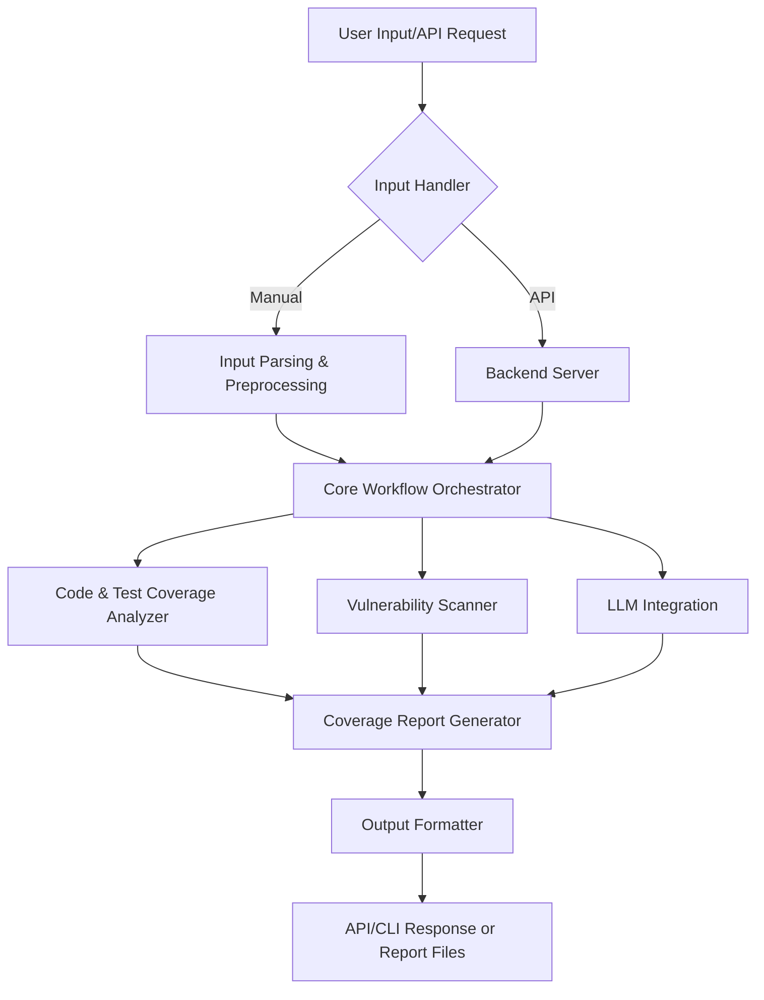

# Functional Coverage Testing using Agentic Systems


## Project Overview

**Coverage Testing** is an advanced framework designed to automate the assessment of code coverage, vulnerability detection, and risk analysis across repositories. It integrates conventional and AI-powered (LLM) approaches to provide a thorough, actionable overview of your codebase’s quality and readiness. 

The repository is organized for both extensibility and clarity, with detailed workflow guides and modular code. Whether you want to analyze your code's test coverage, integrate LLMs for deeper insights, or automate input/output pipelines, Coverage Testing offers a robust platform.

---

## Key Features

- **Automated Coverage Analysis:** Detects untested code paths and provides detailed reports.
- **Vulnerability Assessment:** Scans code for known security risks.
- **LLM Integration:** Enhances code understanding and coverage suggestions using Large Language Models.
- **API-driven:** Offers a Postman collection for full API exploration and automation.
- **Guided Workflows:** Step-by-step guides for every major workflow.
- **Extensive Testing Suite:** Ready-to-run tests for every major component, including backend and LLM layers.

---

## Repository Structure

> Note: This summary covers the most significant files/folders; to see the full list, visit the [GitHub contents page](https://github.com/abhinavuser/coverage_testing/tree/master).


### Root-level Files

- `.gitignore`  
  Specifies files and directories to be ignored by Git—essential for clean version control.

- `COMPLETE_WORKFLOW_GUIDE.md`  
  A comprehensive, step-by-step guide for running the entire workflow from start to finish.

- `HOW_TO_GIVE_INPUT.md`  
  Instructions and formats for providing input to the system, ensuring accurate processing and analysis.

- `IMPLEMENTATION_SUMMARY.md`  
  Summarizes the implementation details, architecture, and design choices.

- `INTEGRATION_SUMMARY.md`  
  Explains how different modules and components interact, with integration best practices.

- `LLM_INTEGRATION_GUIDE.md`  
  Detailed guide for integrating and leveraging LLMs within the coverage framework.

- `README_BACKEND.md`  
  Backend-specific documentation, including architecture, APIs, and developer notes.

- `SETUP_GUIDE.md`  
  Environment and installation setup instructions.

- `Coverage_Framework_API.postman_collection.json`  
  Postman collection to easily test and interact with all API endpoints.

- `app_summary.txt`  
  High-level summary of the application’s purpose and capabilities.

- `env_template.txt`  
  An example environment file—duplicate and modify as `.env` for your own setup.

- `llm_prompt.txt`  
  Templates/prompts used for LLM operations.

- `model.ipynb`  
  (Empty or placeholder) Jupyter notebook for experimentation or demos.

### Core Python Scripts

- `ask_huggingface.py`  
  Handles communication with HuggingFace models/APIs for LLM-based analysis.

- `create_env.py`  
  Script for automating environment setup and configuration.

- `example_usage.py`  
  In-depth usage examples, demonstrating how to use the framework for various scenarios.

- `extract_app_info.py`  
  Extracts metadata, structure, and dependencies from the codebase.

- `full_llm_workflow.py`  
  Runs the complete LLM-powered workflow for coverage analysis.

- `quick_test.py`  
  Rapid test runner for quick validation of the main functions.

- `start_server.py`  
  Script to launch the backend server for API access.

- `start_workflow.py`  
  Orchestrates the entire workflow, from input ingestion to coverage reporting.

- `what_startup_does.py`  
  Explains the startup sequence and initialization logic.

### Testing Suite

- `test_api.py`, `test_complete_workflow.py`, `test_input_methods.py`, `test_llm_integration.py`, `test_llm_with_api.py`, `test_server.py`  
  Extensive test scripts for validating APIs, workflows, LLM integration, and server stability.

### Key Folders

- [`backend/`](https://github.com/abhinavuser/coverage_testing/tree/master/backend)  
  Contains all backend code, including API endpoints and business logic.

- [`data/`](https://github.com/abhinavuser/coverage_testing/tree/master/data)  
  Houses datasets, input examples, and possibly test results or logs.

---

## Setup & Installation

1. **Clone the repository:**
   ```bash
   git clone https://github.com/abhinavuser/coverage_testing.git
   cd coverage_testing
   ```

2. **Set up the environment:**
   - Copy `env_template.txt` to `.env` and update with your local settings.
   - Run `create_env.py` if further environment automation/setup is required.

3. **Install dependencies:**
   - Most dependencies are listed in the guides or can be inferred from the scripts. Run:
     ```bash
     pip install -r requirements.txt
     ```
     (If the requirements file exists. See `SETUP_GUIDE.md` for additional steps.)

---

## Usage Guide

- **Complete Workflow:**  
  Refer to `COMPLETE_WORKFLOW_GUIDE.md` for a full end-to-end walkthrough.

- **Quick Start:**  
  Use `start_workflow.py` to run the main workflow.
  ```bash
  python start_workflow.py
  ```

- **API Usage:**  
  Launch the backend server with `start_server.py` and interact via the provided Postman collection.

- **LLM Integration:**  
  See `LLM_INTEGRATION_GUIDE.md` for setup and usage details.

- **Custom Input:**  
  Format and supply input as described in `HOW_TO_GIVE_INPUT.md`.

---

## API Collection

- Use `Coverage_Framework_API.postman_collection.json` with Postman for comprehensive API testing.
- Endpoints cover input submission, report retrieval, LLM integration, and more.

---

## Backend Architecture

- See `README_BACKEND.md` and `IMPLEMENTATION_SUMMARY.md` for a breakdown of backend code organization, API contracts, and extensibility guidelines.

---

## LLM Integration

- The system can be enhanced by connecting to HuggingFace or other LLM providers (`ask_huggingface.py`).
- Prompts and input formats for LLMs are in `llm_prompt.txt`.
- Use `full_llm_workflow.py` for advanced, automated code coverage assessment using LLMs.

---

## Testing

- Run all tests individually (e.g., `python test_api.py`) or use a test runner.
- Coverage includes API, workflow, integration, and input validation.

---

## How to Contribute

1. Fork the repo and create your branch.
2. Write clear, well-documented code.
3. Add/modify tests as needed.
4. Open a Pull Request with a detailed description.

---

## Further Documentation

- [COMPLETE_WORKFLOW_GUIDE.md](https://github.com/abhinavuser/coverage_testing/blob/master/COMPLETE_WORKFLOW_GUIDE.md)  
- [HOW_TO_GIVE_INPUT.md](https://github.com/abhinavuser/coverage_testing/blob/master/HOW_TO_GIVE_INPUT.md)  
- [IMPLEMENTATION_SUMMARY.md](https://github.com/abhinavuser/coverage_testing/blob/master/IMPLEMENTATION_SUMMARY.md)  
- [INTEGRATION_SUMMARY.md](https://github.com/abhinavuser/coverage_testing/blob/master/INTEGRATION_SUMMARY.md)  
- [LLM_INTEGRATION_GUIDE.md](https://github.com/abhinavuser/coverage_testing/blob/master/LLM_INTEGRATION_GUIDE.md)  
- [README_BACKEND.md](https://github.com/abhinavuser/coverage_testing/blob/master/README_BACKEND.md)  
- [SETUP_GUIDE.md](https://github.com/abhinavuser/coverage_testing/blob/master/SETUP_GUIDE.md)  

For the most up-to-date file list, visit the [GitHub contents page](https://github.com/abhinavuser/coverage_testing/tree/master).  
> _Note: This README only covers the first 30 files. If you need a deep-dive on a specific file or folder, consult the linked documentation or open an issue._

---

## Authors

- [abhinavuser](https://github.com/abhinavuser)
- [Raghu1700](https://github.com/Raghu1700)

---
